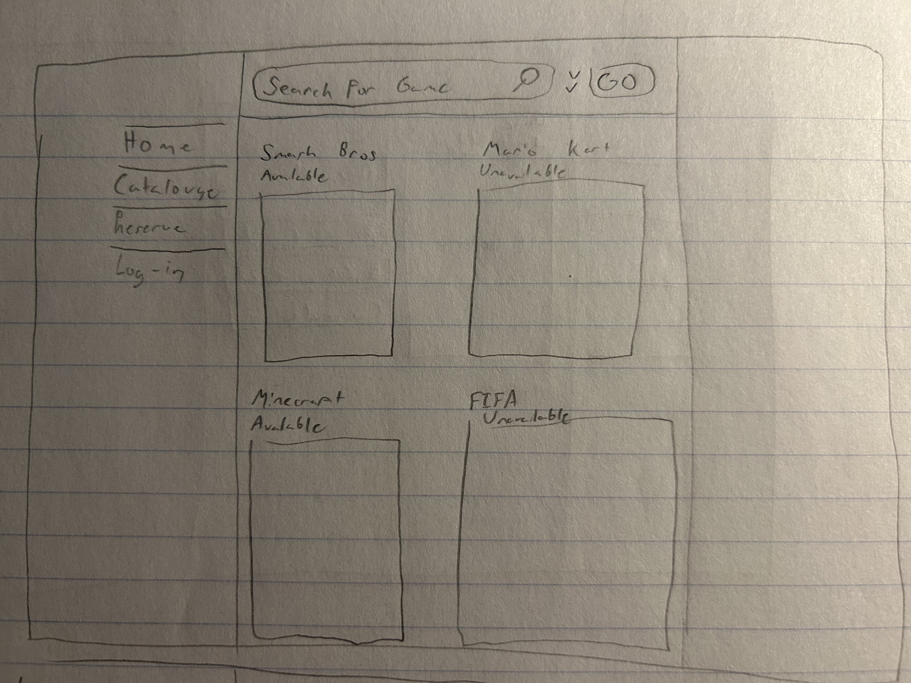
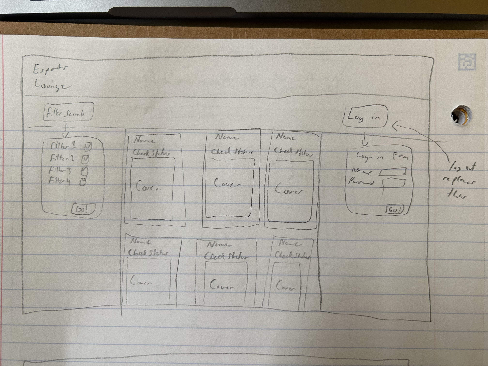
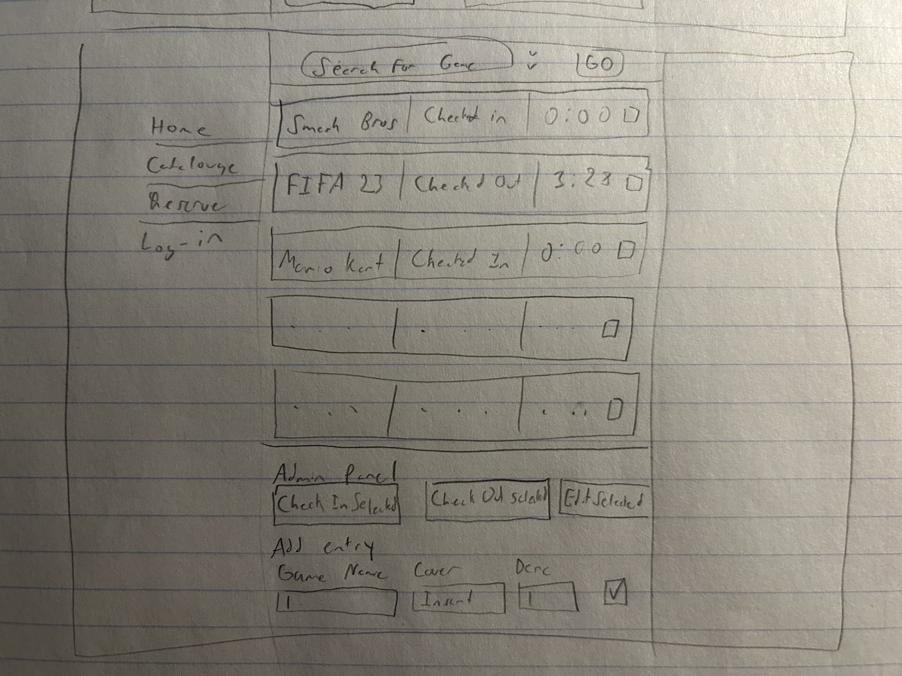
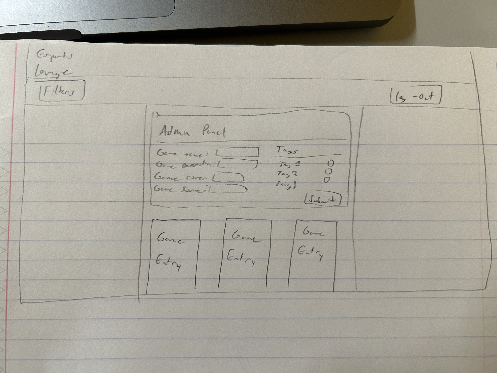
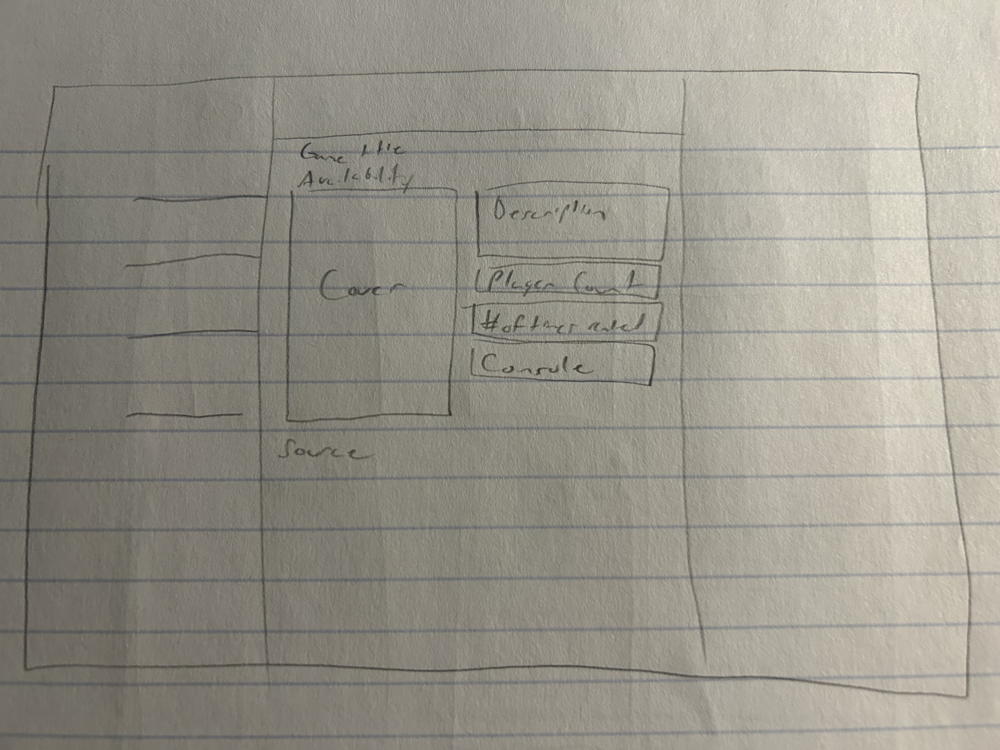

# Project 3: Design Journey

**For each milestone, complete only the sections that are labeled with that milestone.** Refine all sections before the final submission.

You are graded on your design process. If you later need to update your plan, **do not delete the original plan, rather leave it in place and append your new plan _below_ the original.** Then explain why you are changing your plan. Any time you update your plan, you're documenting your design process!

**Replace ALL _TODOs_ with your work.** (There should be no TODOs in the final submission.)

Be clear and concise in your writing. Bullets points are encouraged.

**Everything, including images, must be visible in _Markdown: Open Preview_.** If it's not visible in the Markdown preview, then we can't grade it. We also can't give you partial credit either. **Please make sure your design journey should is easy to read for the grader;** in Markdown preview the question _and_ answer should have a blank line between them.


## Design Plan (Milestone 1)

**Make the case for your decisions using concepts from class, as well as other design principles, theories, examples, and cases from outside of class (includes the design prerequisite for this course).**

You can use bullet points and lists, or full paragraphs, or a combo, whichever is appropriate. The writing should be solid draft quality.


### Catalog (Milestone 1)
> What will your catalog website be about? (1 sentence)

This website will be a game catalouge for all of the Playstation and Nintendo switch games available to play at the newly opened Cornell Esports lounge.

--Update--

This website will be a game catalouge for all of the console games available to play at the newley opened Cornell Esports lounge.


### _Consumer_ Audience (Milestone 1)
> Briefly explain your site's _consumer_ audience. Your audience should be specific, but not arbitrarily specific. (1 sentence)
> Justify why this audience is a **cohesive** group. (1-2 sentences)

The audience will be prospective cornell student visitors to the esports lounge.

This audience is cohesive because within the lounge, only cornell students are able to check out games to play. Cornell students looking to visit the lounge will be the only audience because there would be very little reason for someone else to visit a game catalouge for this specific location.

An admin audience will also exist to add entries.


### _Consumer_ Audience Goals (Milestone 1)
> Document your _consumer_ audience's goals for using this catalog website.
> List each goal below. There is no specific number of goals required for this, but you need enough to do the job (Hint: It's more than 1. But probably not more than 3.)
> **Hint:** Users will be able to view all entries in the catalog and insert new entries into the catalog. The audience's goals should probably relate to these activities.

Goal 1: View available playstation and nintendo switch games at the lounge.

- **Design Ideas and Choices** _How will you meet those goals in your design?_
  - Ensure all games that are present within the lounge are listed on the site.
  - Have an indicator of whether or not that game is checked out at the lounge.
- **Rationale & Additional Notes** _Justify your decisions; additional notes._
  - By having all games in the lounge (and not just the ones that aren't checked out), the audience will be able to see what they may be able to check out in the future.
  - With an indicator of whether the game is checked in or out, a potential visitor of the lounge can go knowing that a game they want to play is available or not.

--Update--

The functionality of whether a game is checked in or not is present within the site, however due to time restraints and the fact that something like that is not required for the site, admins are not able to check entries in or out. Other than the seed data, all new entries will be marked as unavailable.

Goal 2: Give admins the ability to add new additions to the lounge and remove games that have been taken away.

--Update--

Give admins the ability to add new additions to the lounge.

- **Design Ideas and Choices** _How will you meet those goals in your design?_
  - Make a seperate admin page to give quick access for adding and deleting new entries.
  - On this page, don't use images to represent the games but only text.

--Update--
Admins use the same page as the consumers. An admin panel appears on the top of the catalouge instead, as a whole new page could be confusing when an admin is looking to see if the image properly uploaded. It's also just not necessary and adds an extra step to the process of adding a game that in reality isn't needed.

- **Rationale & Additional Notes** _Justify your decisions; additional notes._
  - The text only admin page would make it quicker for an admin to see the games available, and it would streamline their ability to add and remove games.

--Update--
Admins will use the same page as the consumers. It is not any quicker if all the games were represented as just text, and an admin panel at the top of the page would make it very easy to add games without any jargin.

Goal 3: Allow for searching and sorting of games available.

- **Design Ideas and Choices** _How will you meet those goals in your design?_
  - Include a search bar for both admin and consumer page.
  - Include a filter for both admin and consumer page. Have filters for checked in games, co-op games, or nintendo and playstation.

--Update--
Searching through a search bar is not needed for admins. Given the context of the site and the requirements of the project, there just aren't that many games to look through. If the lounge had more than 50 games, an admin should reasonably have access to a search function, but this is not the case. Ctrl-F works just fine as well. The admin audience would be able to find this stuff without a search bar and using only filters.


- **Rationale & Additional Notes** _Justify your decisions; additional notes._
  - A search bar would enhance a visitors ability to find what games are checked in, and what games are available. If they are looking for a specific game, they won't have to scroll through all the games, and a quick search would be just enough.
  - To the goal of finding whats available, a filter would also help by reducing search results and streamlining the search process.

--Update--
Although a search bar would help consumers of the site see what games are available, given the scope of the catalouge, there are so little games that it isn't very practical to have one. The filters are good at reduing the amount of entries to see, and it makes it easy to find a game you are looking for.

### _Consumer_ Audience Device (Milestone 1)
> How will your _consumer_ audience access this website? From a narrow (phone) or wide (laptop) device?
> Justify your decision. (1 sentence)

The website will be visited primarily of wide laptop devices.

This is because if someone is planning a visit to the lounge, that planning would more likely take place at home before the come. For admins, most if not all current administrative work is done on our laptops or desktops within the lounge itself. Phones have limited connection within the lounge so computers are usually the way to go.


### _Consumer_ Persona (Milestone 1)
> Use the goals you identified above to develop a persona of your site's _consumer_ audience.
> Your persona must have a name and a face. The face can be a photo of a face or a drawing, etc.

Persona Face:

[Source](https://eurekaergonomic.com/blog/what-are-gamers-eyes/)

Persona name:
William

**Factors that Influence Behavior:**

- Frequent user of the TV's in the gaming Lounge
- Loves FIFA

**Goals:**

- Wants to come visit the lounge to play on the playstation
- Wants to know if our new lounge has FIFA
- Really wants to play fifa with friends or by himself in the lounge

**Obstacles:**

- William doesn't want to come to the lounge we dont have FIFA.
- William can't visit the gaming lounge frequently, he is a busy man, and wants to maximize his time there.

**Desires:**

- William wants to visit the esports lounge to primarily play FIFA with a few of his buddies.
- He doesn't want to arrive to the lounge and find out that his favorite game is already checked out.
- He wants to make sure that we have the most up to date copy of FIFA because he only likes the new one.


### _Administrator_ Audience (Milestone 1)
> Briefly explain your site's _administrator_ audience. Your audience should be specific, but not arbitrarily specific. (1 sentence)
> Justify why this audience is a **cohesive** group. (1-2 sentences)

The administrator audience for the cornell esports lounge consists of only employees of the lounge.

This is a cohesive audience because the only people that would ever have to add entries would be cornell esports lounge staff and no one else. There is only one staff position, other than our manager, so the audience is as cohesive as it gets.


### _Administrator_ Audience Goals (Milestone 1)
> Document your _administrator_ audience's goals for using this catalog website.
> List each goal below. There is no specific number of goals required for this, but you need enough to do the job (Hint: It's more than 1. But probably not more than 3.)
> **Hint:** Users will be able to view all entries in the catalog and insert new entries into the catalog. The audience's goals should probably relate to these activities.

Add, remove and edit games in the catalouge.

- **Design Ideas and Choices** _How will you meet those goals in your design?_
  - Create an admin panel page on the website
  - This would include a compact text-only interface with a search and a filter, to easily find entries.
  - Simple buttons to add and remove entries would be a good idea.

- **Updated Design Ideas and Choices** _How will you meet those goal in your design?_
  - Create an admin panel on the catalouge page of the website
  - This would include a form to add a new game and tags that should be added to that game.

- **Rationale & Additional Notes** _Justify your decisions; additional notes._
  - A filter feature would still be useful to employees, as it would streamline the process of finding games.
  - A simple form is a good form. By creating a small panel to add a game, new admins wont be confused on what to do.

Check games in and out using the catalouge.

- **Design Ideas and Choices** _How will you meet those goals in your design?_
  - Create a check in / out button on the admin page for each game.
  - Create a filter for checked in games on the search.
- **Rationale & Additional Notes** _Justify your decisions; additional notes._
  - A part of the job of an employee is to check games out to people. Using the website to mark if a game is checked out would be useful to both the employee and people trying to see if a certain game is checked out or not.
  - The filter would streamline the process of seeing what games are already checked out, so the employee can easily check in.

--Update--
This entire feature will no longer be included in my final project 3 submission. The catalouge will only be for all games that the catalouge holds. No information on whether or not they are checked in or not. This feature may be addede in the future, as I still believe it is important for admins to use.


### _Administrator_ Persona (Milestone 1)
> Use the goals you identified above to develop a persona of your site's _administrator_ audience.
> Your persona must have a name and a face. The face can be a photo of a face or a drawing, etc.


Persona Name:

[Source](https://www.roberthalf.com/blog/evaluating-job-candidates/how-to-hire-an-office-clerk)
Emily

**Factors that Influence Behavior:**

- Emily is an employee of the esports gaming lounge
- Emily works at the front desk of the lounge, and is a frequent visitor herself.

**Goals:**

- Emily wants a list of all games we have, rather that having to physically look through them all.
- Emily needs to add new games to the database that are added to the lounge.

**Obstacles:**

- Emily works daily, and usually works during rush hours.
- Emily frequently gets asked if they have certain games, and is bothered by the frequent question.

**Desires:**

- Emily wants to see what games we have without having to go around the room to see for herself.
- Emily wants to inform everyone of what games are available without having to hand visitors the physical box of games we have.


### Catalog Data (Milestone 1)
> Using your personas, identify the data you need to include in the catalog for your site's audiences.
> Justify why this data aligns with your persona's goals. (1 sentence)

Data for William:

- Box art of games
- Game titles
- Game description
- Game check-out status
- How many players the game supports
- What console the game is for

Data for Emily:

- Game titles
- Game check-out status
- Number of times the game has been checked out
- How long a game has been checked out for

William needs all that data because he is a consumer of the game. He wants to make sure we have the most recent FIFA in stock, so the game title along with the box art will help him with that.

Emily needs the checkout status to do her job (not anymore), and the time since check out is important to make sure no one is spending too long on a game (also not a thing anymore). Number of times a game has been checked out is just for fun.

--Update--

Emily no longer needs to check games in and out, and as a result the data for her will be the exact same as the data for william. Emily needs the box art, the title, description, and it's tags, just to make sure that the data she entered when adding a new game was properly inserted.


### Site Design (Milestone 1)
> Design your catalog website to address the goals of your personas.
> Sketch your site's design:
>
> - These are **design** sketches, not _planning_ sketches.
> - Use text in the sketches to help us understand your design.
> - Where the content of the text is unimportant, you may use squiggly lines for text.
> - **Do not label HTML elements or annotate CSS classes.** This is not a planning sketch.
>
> Provide a brief explanation _underneath_ each sketch. (1 sentence)
> **Refer to your persona by name in each explanation.**


This is the sketch of the consumer catalouge. There's thumbnails and availability along with cover art for the game. It follows a basic grid format. This is good for william because the game availability can be known without clicking on the thumbnail.

--Updated Sketch--


This is the 2nd sketch of the consumer catalouge. The difference between this one and the last one is that it lacks a search bar and instead goes for a filter search form. It also has a place for a login box, which was not included in the last sketch. Both filter button and log in button will have a drop down for the forms to actually appear.


This is the admin catalouge. Theres a form at the bottom to edit and add new entries. Unlike the consumer one, this one is a list format, as admins dont need cover art to understand what game they are looking at. Emily, our admin persona, doesn't need consumer details because she works at the lounge. She knows the games and only needs the names.

--Updated Sketch--

I decided that it would be better if the admin panel was just on the same page as the consumer catalouge. Admins need to see the game they entered to make sure its description, cover, and all of its data was submitted correctly. Also having a one page website makes everything very easy to figure out. In this sketch I just have the admin panel appear upon login above the game entries. The log out button also replaces the log in button.


This is what it would look like if you clicked on an entry from the consumer catalouge. For William, everything he could need to know about the game is here, including player count, console, description, and even amount of people who have checked it out.

--Updated Sketch--
The details page will remain the same. The only thing that I should add is a back button to go back to the main page. Thats it.


### Catalog Design Patterns (Milestone 1)
> Explain how you used design patterns in your site's design. (1-2 sentences)

The game catalouge is in a grid format. It's something you'd see on youtube, with thumbnails displaying a title and a little more info. When you click on it, youll get more info. It follows that similar pattern.


## Implementation Plan (Milestone 1, Milestone 2, Milestone 3, Final Submission)

### Database Schema (Milestone 1)
> Plan the structure of your database. You may use words or a picture.
> A bulleted list is probably the simplest way to do this.
> Make sure you include constraints for each field.

CREATE TABLE games (

- id INTEGER NOT NULL UNIQUE,
- name TEXT NOT NULL,
- description TEXT NOT NULL,
- checked INTEGER NOT NULL,
- source TEXT NOT NULL,
- cover_id INTEGER NOT NULL,
- PRIMARY KEY(id AUTOINCREMENT),
- FOREIGN KEY(cover_id) REFERENCES covers(id)

);

CREATE TABLE game_tags (

- id INTEGER NOT NULL UNIQUE,
- game_id INTEGER NOT NULL,
- tag_id INTEGER NOT NULL,
- PRIMARY KEY(id AUTOINCREMENT),
- FOREIGN KEY(game_id) REFERENCES games(id) FOREIGN KEY(tag_id) REFERENCES tags(id)

);

CREATE TABLE tags (

- id INTEGER NOT NULL UNIQUE,
- tag TEXT NOT NULL,
- PRIMARY KEY(id AUTOINCREMENT)

);

CREATE TABLE covers (

- id INTEGER NOT NULL UNIQUE,
- cover_name TEXT NOT NULL,
- cover_ext TEXT NOT NULL,
- PRIMARY KEY(id AUTOINCREMENT)

);

### Database Query Plan (Milestone 1, Milestone 2, Milestone 3, Final Submission)
> Plan _all_ of your database queries.
> You may use natural language, pseudocode, or SQL.

```
Select all tag ids where the tagname is equal to a selected tag
"SELECT id FROM tags WHERE tag = :tag",
          array(
            ':tag' => $tagname
          )
```

```
Select all data from games
'SELECT * FROM games';
```

```
Select all data from tags
'SELECT * FROM tags'
```

```
Select all distinct games where their tags match with ones selected by the user
"SELECT DISTINCT games.id, name, source, cover_id, checked FROM games
  INNER JOIN game_tags ON games.id = game_tags.game_id
  INNER JOIN tags ON game_tags.tag_id = tags.id
  WHERE tags.tag IN ("tag1","tag2", etc..)";
```

```
Select all game covers where the cover id is the same as the game id
"SELECT covers.cover_name AS 'covers.cover_name', covers.cover_ext AS 'covers.cover_ext' FROM covers WHERE covers.id = $game id;"
```


## Complete & Polished Website (Final Submission)

### Accessibility Audit (Final Submission)
> Tell us what issues you discovered during your accessibility audit.
> What do you do to improve the accessibility of your site?

I had some contrast issues with the white text against blue in my header. I just made it so that the text had its own darker background and it fixed the issue.

I also had an issue where all of my game entries had "no text in the link" so it was an accessibility concern. I added an aria-label element to give the interactive element some form of text label. This fixed all of the errors.

The last error I have, and one I geuninely for the life of me could not figure out, even after going to office hours and asking on ed, is the page language error. Despite me setting the lang attribute on the html to "en", It literally does not fix anything. There is NO HTML other than DOCTYPE above the lang attribute, and I really do not understand AT ALL why there is a language error. It's just ultra frustrating. PLEASE DONT TAKE OFF POINTS! I REALLY DID ASK FOR HELP AND TRIED TO FIX IT, I DONT UNDERSTAND!


### Self-Reflection (Final Submission)
> Reflect on what you learned during this assignment. How have you improved from Projects 1 and 2?

During this assignment I learned so much about backend programming. I feel like I have imrpoved in my backend skills compared to projects 1 and 2 however I feel like I still need a lot more practice. I may have learned these skills but they are still new to me, and it will take a long time before I really own them.


> Take some time here to reflect on how much you've learned since you started this class. It's often easy to ignore our own progress. Take a moment and think about your accomplishments in this class. Hopefully you'll recognize that you've accomplished a lot and that you should be very proud of those accomplishments! (1-3 sentences)

I'm really happy to see how my website turned out. Sure, it's a little bit of a buggy mess but for the most part it works and doesn't look half bad. I knew nothing about backend before I entered 2300 and now I can at least say I know how to make a form. I'm excited to see what else I can do with the skills I've gained from this class.


### Collaborators (Final Submission)
> List any persons you collaborated with on this project.

None


### Reference Resources (Final Submission)
> Please cite any external resources you referenced in the creation of your project.
> (i.e. W3Schools, StackOverflow, Mozilla, etc.)

None


### Grading: User Accounts (Final Submission)
> The graders will need to log in to your website.
> Please provide the usernames and passwords.

**Administrator User:**

- Username: Liam
- Password: monkey

**Consumer User:**

- No consumer user

**Note:** Not all websites will support consumer log in. If your website doesn't, say so.


### Grading: Step-by-Step Instructions (Final Submission)
> Write step-by-step instructions for the graders.
> The project if very hard to grade if we don't understand how your site works.
> For example, you must log in before you can delete.
> For each set of instructions, assume the grader is starting from /

_View all entries:_

1. If you're on the home page (catalouge page), congrats! You can view all entries.

_View all entries for a tag:_

1. Click the select filters button on the catalouge page to display a dropdown of filters.
2. If the select button isn't working, refresh the page a few times. This may be an issue with my Jquery code.
3. Select you filters and press the search button.
4. If you select "No Filters" in combination with anything else, the page will default to having no filters and will ignore every other filter.

_View a single entry's details:_

1. On the catalouge page, click on a games cover to view its details.
2. Use the back button on the details page to go back to the catalouge.

_How to insert and upload a new entry:_

1. By default, the user should not be logged in. On the top right of the catalouge page, press the log in button.
2. A dropdown should appear. If not, refresh the page a few times and keep clicking. This again is probably an issue with my Jquery.
3. Login using the username Liam and the password monkey.
4. If the login is not successful, the admin panel will not display. You will have to click on the log in button again.
5. On successful log in, the admin panel will show up on the top of the catalouge page.
6. Input the data for the game you wish to enter.
7. For the cover, I have provided a sample for you to use withint my public/images folder. It is called fallguyssampler.jpeg.
8. For the source, you may input either a link or plain text.
9. Select the tags you want the game to have.
10. Press submit, and scroll to the bottom of the page to see your entry!
11. If the page is frozen, refresh the page, log out, and try again. I apologize for this but for the most part this should not happen at all.

_How to delete an entry:_

1. Not implemented
